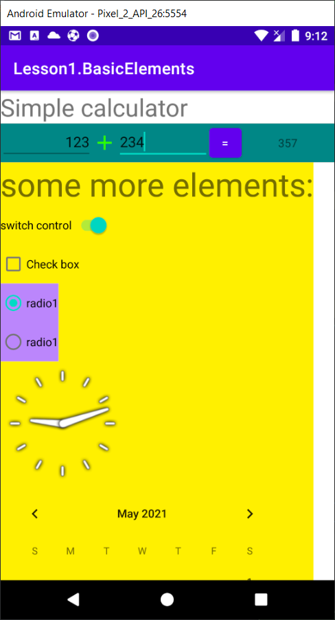
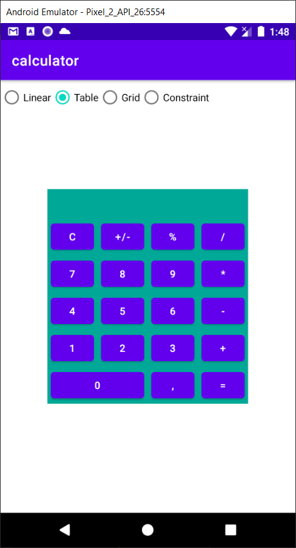
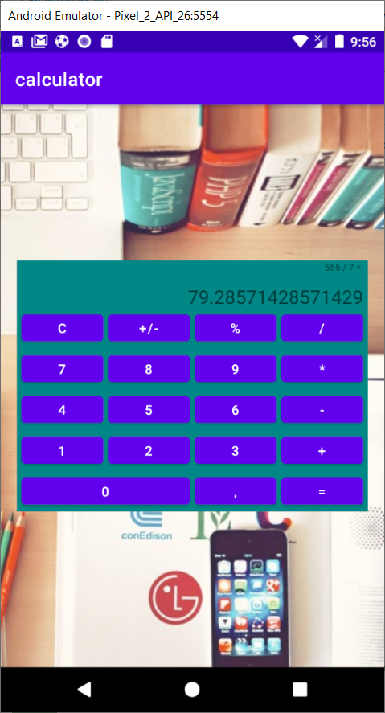
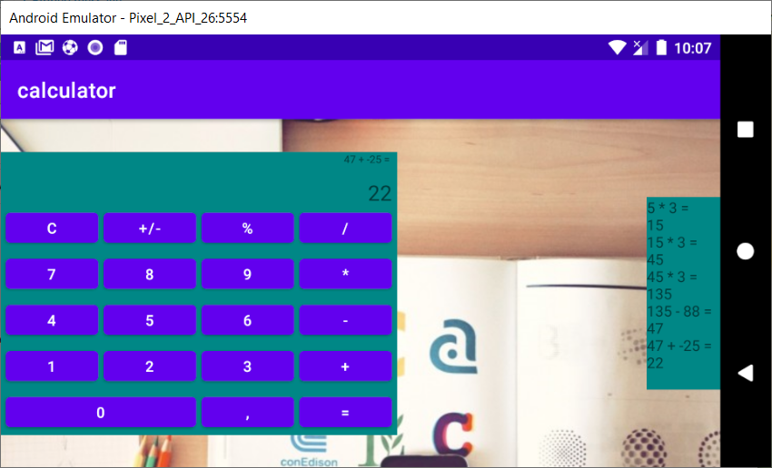
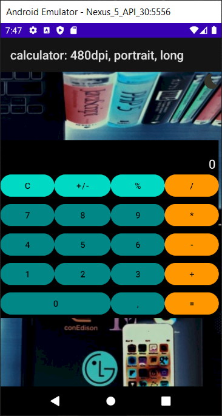
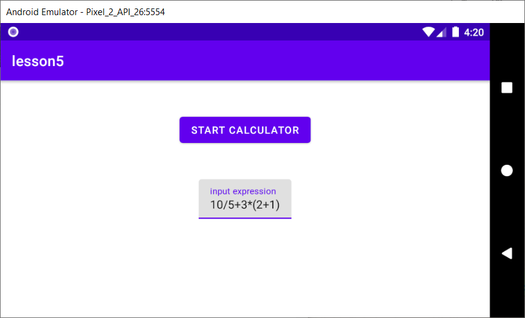

# Android1@geekbrains
## Lesson1: basic control elements
### Preview
 

## Lesson2: layout/ViewGroup calculator
### Preview
 

## Lesson3: Activity lifecylce: calculator processing
### Preview
 
 

## Lesson4: Resources: calculator dark-mode
### Preview

## Lesson5: Intents: start calculator and pass data to process
### Preview
 

